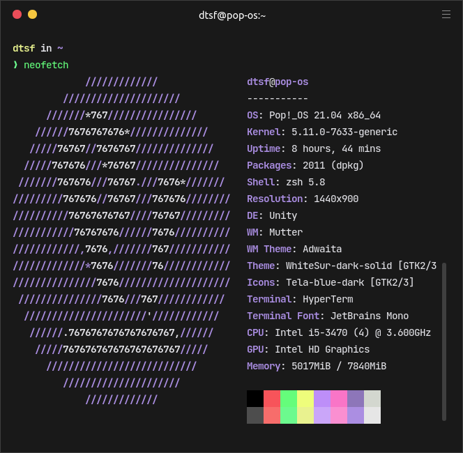

<h1 align="center">
   
  Omni Customized for <a href="https://hyper.is">Hyper</a>
   
</h1>

  <strong>Dark theme for <a href="https://hyper.is">Hyper</a></strong>

  

  

  <a href="#install">Install</a> •
  <a href="#description">Description</a> •
  <a href="#original-theme">Original Theme</a> •
  <a href="#license">License</a>

  

## Install

All instructions can be found at [INSTALL.md](./INSTALL.md).

## Description

This is a fork of Omni Theme for hyper by Rocketseat with color changes for personal use.

## Original Theme

You can find the original hyper theme of Omni [here](https://github.com/getomni/hyper).

## License

[MIT License](./LICENSE.md)
